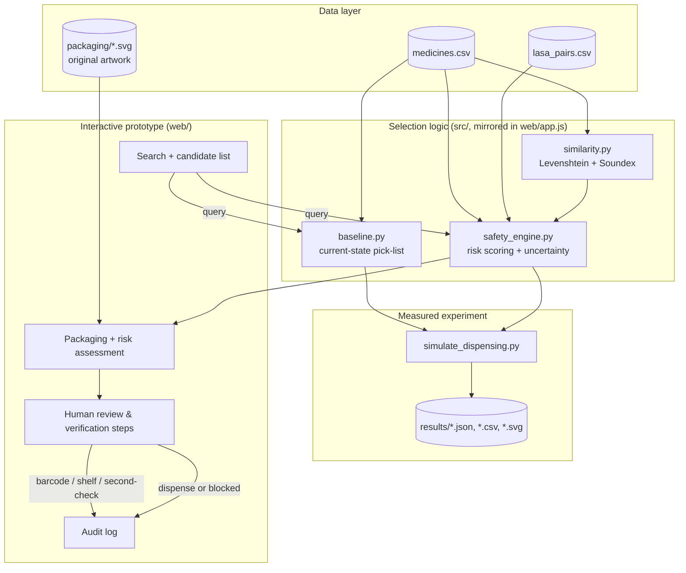

# Architecture

## Design principles

1. **Uncertainty is always shown, never hidden.** Every candidate carries a visible
   confidence score. The system never silently substitutes its best guess for an
   explicit human decision.
2. **Risk drives friction, not the reverse.** Low-risk, unambiguous picks stay fast.
   High/Critical-risk or ambiguous picks force a mandatory, logged, independent check
   before dispensing is allowed to proceed.
3. **Ties are never auto-resolved.** If two candidates score within `TIE_MARGIN` of
   each other, the system refuses to presume intent and forces explicit
   disambiguation.
4. **Curated knowledge + generalisable detection, not either/or.** A curated list of
   institutionally-known LASA pairs (`data/lasa_pairs.csv`) is treated as a floor.
   The same similarity function that would generalise to *newly stocked* medicines
   also runs live, so the system isn't blind to confusions nobody has documented yet.
5. **Physical checks catch what name-matching cannot.** Packaging and shelf-location
   confusion is independent of name similarity, so barcode scan and shelf-location
   checks are modelled as separate, mandatory confirmations for high-risk items - not
   folded into the search logic.

## Component diagram

## Human-in-the-loop model

The system **never dispenses on its own**. Every path through the proposed interface
ends at a human action:

| Step | Who | System role | Human role |
|---|---|---|---|
| Query typed/transcribed | Technician/nurse/pharmacist | Suggest ranked candidates with confidence | Chooses which candidate to open |
| Risk assessment shown | System | Show risk level, confusable neighbours, harm-if-wrong | Reads and decides whether to proceed |
| Barcode scan (High/Critical only) | Technician | Compare scanned code to expected item | Physically scans the item in hand |
| Shelf/location check | Technician | Compare scanned/entered location to expected | Confirms physical location |
| Independent second check (High/Critical or ambiguous tie) | A *second*, independent clinician | Records the check occurred | Independently verifies name/strength/route |
| Final confirm | Technician/pharmacist | Enables the button only once required checks pass | Makes the final dispensing decision |
| Override | Technician | Requires and logs a typed reason; never silent | Chooses to override and is accountable for the reason |

This mapping is also what `tests/test_safety_engine.py` and
`docs/patient_journeys.md` verify concretely, rather than only asserting it in prose.

## Why this architecture (vs. alternatives considered)

- **Why not a single "smart autocomplete" that just shows the best match?**
  Because the failure mode we're targeting is exactly a *wrong* best match being
  trusted. A single suggestion without visible uncertainty reproduces the problem
  rather than solving it.
- **Why not a machine-learned ranking model?** The dataset of real dispensing
  near-misses needed to train one safely does not exist in this project's scope, and
  an opaque model would make the "why is this risky" explanation - which is the
  actual safety intervention - harder to audit. A deterministic, inspectable
  similarity + curated-pair engine is auditable by a pharmacy safety committee line by
  line, which matters more than marginal ranking quality at this stage. This is
  revisited as a future-work item in `docs/error_analysis.md`.
- **Why keep baseline and proposed engines separate rather than one engine with a
  flag?** So the comparison in `docs/before_after_comparison.md` cannot accidentally
  leak proposed-engine behaviour into the baseline measurement.
