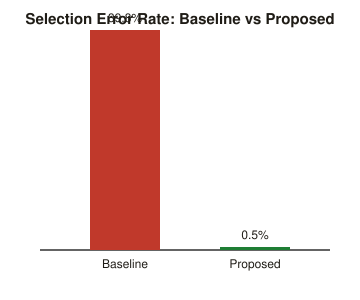

# Before / after comparison - controlled dispensing test

Reproduce with: `python -m src.simulate_dispensing` (seed = 42, deterministic).
Raw outputs: `results/experiment_results.json`, `results/error_analysis.csv`,
`results/trial_log.csv`, `results/comparison_chart.svg`.

## Method summary

800 simulated selection trials (100 per curated LASA pair x 8 pairs), each starting
from a corrupted input representing a realistic mis-hearing, rushed partial type,
or single mis-transcribed character. Every trial is run through both engines on the
same input so the comparison is directly controlled. 80 additional control trials
on 2 non-LASA medicines measure false-positive friction.

## Headline result

| Metric | Baseline (current process) | Proposed (safety interface) | Target |
|---|---:|---:|---:|
| Selection error rate | **39.75%** (318 / 800) | **0.50%** (4 / 800) | - |
| Errors prevented | - | **314 of 318** | - |
| Percent reduction in selection errors | - | **98.74%** | **>=90%** |
| Target met? | - | **Yes** | >=90% |
| False-positive flag rate on safe/control items | n/a (baseline has no flags) | **0.0%** (0 / 80) | as low as possible |

The baseline error rate is a controlled simulation result produced by deliberately
corrupting test inputs to stress the selection process. It is not a claim about
real-world clinical incident rates. The result should be interpreted as a
relative comparison between the two engines on the same generated inputs.

## Per-pair breakdown

| LASA pair | Trials | Baseline errors | Proposed errors |
|---|---:|---:|---:|
| Hydralazine / Hydroxyzine | 100 | 40 | 0 |
| Vinblastine / Vincristine | 100 | 32 | 0 |
| Epinephrine / Ephedrine | 100 | 30 | 0 |
| Insulin Lispro / Insulin Glargine | 100 | 59 | 0 |
| Hydromorphone / Morphine | 100 | 30 | 0 |
| Losartan / Lorazepam | 100 | 35 | 0 |
| Chlorpromazine / Chlorpropamide | 100 | 58 | 0 |
| **Metformin / Metronidazole** | 100 | 34 | **4** |

The remaining proposed errors are concentrated in the Metformin / Metronidazole
pair. This residual behaviour is documented in `docs/error_analysis.md`.

## Safety and validation notes

- The proposed engine reduced simulated selection errors by **98.74%** on the
  controlled test set.
- Control false-positive flags remained **0 / 80 (0.0%)**.
- The 88% second-check catch rate is a modelling assumption, not an empirical
  clinical finding.
- The 90% reduction is a stakeholder-set prototype target, not a clinical or
  regulatory claim.
- Real deployment would require clinical workflow validation, local LASA-risk
  governance, real barcode hardware testing, and validation with actual pharmacy
  staff.

'@ | Set-Content docs/before_after_comparison.md
